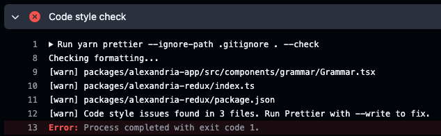

# Wilhelm

<div align="center">
    <a href="https://github.com/QubitPi/wilhelm/actions/workflows/ci-cd.yaml"></a>
    <a href="https://paion-data.sentry.io/issues/?project=4508210539528192"></a>
    
    
    
    <a href="https://yarnpkg.com/"></a>
    <a href="https://eslint.org/"></a>
    <a href="https://prettier.io/"></a>
    <a href="https://jest.qubitpi.org/"></a>
    <a href="https://cypress.qubitpi.org"></a>
    <a href="https://developer.chrome.com/docs/lighthouse/overview"></a>
    <a href="https://www.apache.org/licenses/LICENSE-2.0"></a>
    <br/>
    <a href="https://app.argos-ci.com/qubitpi/wilhelm/reference"></a>
</div>

<!-- TOC -->

- [Wilhelm](#wilhelm)
  - [How Did Project Wilhelm Start](#how-did-project-wilhelm-start)
    - [Why Do I Decide to Scale Project Wilhelm](#why-do-i-decide-to-scale-project-wilhelm)
  - [Development](#development)
    - [Starting Locally](#starting-locally)
    - [Testing](#testing)
  - [License](#license)
  <!-- TOC -->

**Wilhelm** is a Quizlet alternative that helps with learning German, Ancient Greek, and Latin with 2 unique features:

1. Applying historical fonts that is unique to each language
2. Utilizing knowledge graph to visualize connections among Indo-European languages which greatly make multilingual
   study much more efficient

Please check out the app on [wilhelm.qubitpi.org](https://wilhelm.qubitpi.org/)

## How Did Project Wilhelm Start

Wilhelm started out as a Quizlet "companion" with no intent to be used by anyone other than myself.

I was studying Ancient Greek vocabulary on Quizlet the other day and got shockingly frustrated by their flashcards with
this horribly formatted Greek text:

<div align="center">
    
</div>

Quizlet didn't believe that each language shines with their unique fonts from history (such as
[楷书](http://www.9610.com/zhmf/daode.htm) for Chinese,
[Gothic](https://hmmlschool.org/latin/) for Latin, and [Fraktur](https://en.wikipedia.org/wiki/Fraktur) for German).
They simply applied a monofont for all languages which, in the case of Greek, made the text look terribly uncomfortable.
I certainly disavowed it and decided to make my own flash card which ended up with much better visual like this:

<div align="center">
    
</div>

> [!NOTE]
>
> The new font above was inspired by the Zeph fonts invented by
> [the Loeb Classical Library in Harvard University](https://www.hup.harvard.edu/series/loeb-classical-library), who publishes Ancient Greek and Latin original texts
> I've been enjoying reading since I was a college student.
>
> The Zeph fonts are based on 'Porson' Greek
> [according to the information provided by Harvard University Press](https://www.loebclassics.com/page/logo) (HUP). But
> the Zeph\* fonts themselves seem to be custom commissions for HUP for use in Loeb books, which means the fonts are
> close-sourced[^1].
>
> The closest font I found, thus, is the
> [GFS Porson for Ancient Greek](https://www.google.com/search?q=GFS+Porson+for+Ancient+Greek) which ended up being the
> Greek font I use for the flash cards in this project

### Why Do I Decide to Scale Project Wilhelm

Right after, I began to realize I could simply throw Quizlet to trash. I deleted my Quizlet account and relied solely on
Wilhelm. I was happy that I found a lot more pleasure studying languages with Wilhelm than I did on Quizlet.

In the meantime, I've been interested in Indo-European languages. Having been concurrently studying Ancient Greek,
Latin, and German, I got constantly well impressed by how these languages are
[_connected in various interesting ways_](https://github.com/QubitPi/wilhelm-vocabulary?tab=readme-ov-file#interesting-queries).
I then believe making such connections between languages visually explicit shall **boost people to learn multiple
languages much faster**.

## Development

Wilhelm has the following packages:

- [`wilhelm-app`](packages/wilhelm-app): holding business logics of the app
- [`wilhelm-redux`](packages/wilhelm-redux): managing all app states. Wilhelm uses
  [Redux state management][Redux]
  [][Redux]
  instead of ~~[React state management][useState]~~ for a much more maintainable decoupling of React components

### Getting Source Code

```console
git clone git@github.com:QubitPi/wilhelm.git
cd wilhelm
```

Install dependencies by

> [!NOTE]
>
> Node 18 and Yarn 2 must be installed in local environment.

```console
yarn
```

### Scripts

- `yarn start`: Runs the app in development mode. Open http://localhost:3000 to view it in the browser. The page automatically reloads
  if we make changes to the code. we will see the build errors and lint warnings in the console.
- `yarn test`: Runs the unit tests
- `yarn cypress:open` & `yarn e2e`: Opens Cypress End-to-End test console and runs the End-to-End tests, respectively
- `yarn build`: Builds the app for production to the build folder. It correctly bundles React in production mode and
  optimizes the build for the best performance. The build is minified and the filenames include the hashes.

### Automatically Formatting Codebase

When CI/CD complains about "Code style check" as the following:



Simply run the following command at project root which will auto formatting the codebase using Prettier:

```console
yarn prettier --ignore-path .gitignore . --write
```

> [!TIP]
>
> It's always a good practice to auto-formatting code whenever convenient 

## Application Monitoring

sentry.io has been integrated into the [wilhelm.qubitpi.org](https://wilhelm.qubitpi.org/). Specifically:

- [sourcemap](https://docs.sentry.io/platforms/javascript/legacy-sdk/sourcemaps/) is uploaded to sentry during build time
- error trace are sent to sentry during run time

While error trace will always be sent in production mode (`process.env.NODE_ENV === "production"`), an
[.env.sentry-build-plugin](https://docs.sentry.io/platforms/javascript/sourcemaps/uploading/webpack/) is, however,
required for `yarn build` to be able to generate and upload the sourcemap.

> [!NOTE]
>
> If the `.env.sentry-build-plugin` is not present, `yarn build` will still run successfully. It's just not possible
> then to locate the exact location of error in code on sentry issue console because sourcemap hasn't been uploaded

## License

The use and distribution terms for [wilhelm]() are covered by the [Apache License, Version 2.0](./LICENSE).

[Redux]: https://react-redux.qubitpi.org/
[useState]: https://react.qubitpi.org/reference/react/useState

[^1]: https://tex.stackexchange.com/a/163342/277953
