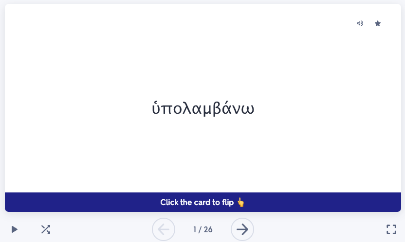
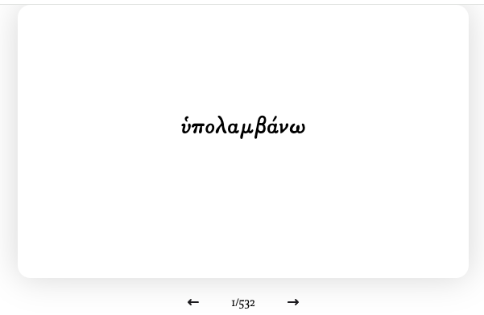

Wilhelm
=======

![Node Version][node version badge]
[![Deployment][Deployment badge]][Deployment dashboard URL]
[![Apache License][Apache License Badge]][Apache License, Version 2.0]

How Did the Project Start
-------------------------

I was using Quizlet to study Ancient Greek vocabulary the other day and witnessed this horribly formatted Greek text on
their online flashcard:

<div align="center">
    
</div>

The Greek font looked terribly uncomfortable; Quizlet used the same font for all languages and I certainly didn't like
it. So I decided to make my own flash card which ended up with much better visual like this:

<div align="center">
    
</div>

> [!NOTE]
>
> The new font was inspired by the Zeph fonts invented by
> [the Loeb Classical Library in Harvard University](https://www.hup.harvard.edu/series/loeb-classical-library), who did
> a pretty good job on publishing Ancient Greek and Latin original texts.
> 
> The Zeph fonts are based on 'Porson' Greek
> [according to the information provided by Harvard University Press](https://www.loebclassics.com/page/logo) (HUP). But
> the Zeph* fonts themselves seem to be custom commissions for HUP for use in Loeb books, which means the fonts are
> close-sourced[^1].
> 
> The closest font I found, thus, is the [GFS Porson for Ancient Greek](https://www.oocities.org/greekfonts/) which ended up being the Greek font I use
> for the flash cards in this project

Development
-----------

> [!IMPORTANT]
> 
> Wilhelm requires Node 18 or above

To start flashcards locally:

```console
git clone git@github.com:QubitPi/wilhelm.git
cd wilhelm
yarn
yarn start
```

Then visit [localhost:3000](http://localhost:3000/)

License
-------

The use and distribution terms for [wilhelm]() are covered by the [Apache License, Version 2.0].

[Apache License, Version 2.0]: https://www.apache.org/licenses/LICENSE-2.0
[Apache License Badge]: https://img.shields.io/badge/Apache%202.0-F25910.svg?style=for-the-badge&logo=Apache&logoColor=white

[Deployment badge]: https://img.shields.io/badge/Vercel-000000?style=for-the-badge&logo=vercel&logoColor=white
[Deployment dashboard URL]: https://vercel.com/qubitpis-projects/wilhelm

[node version badge]: https://img.shields.io/badge/NODE-18-339933?logo=Node.js&logoColor=white&labelColor=66cc33&style=for-the-badge

[^1]: https://tex.stackexchange.com/a/163342/277953
